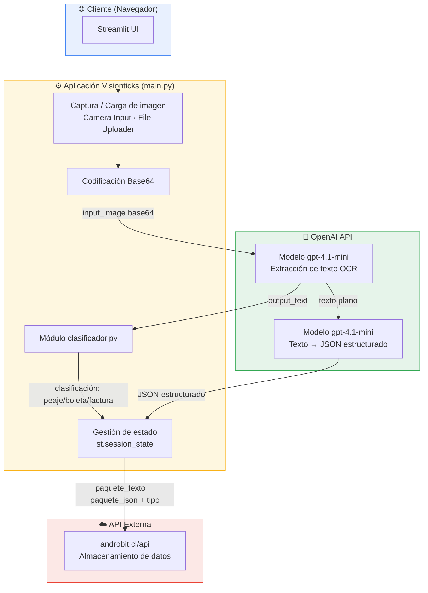
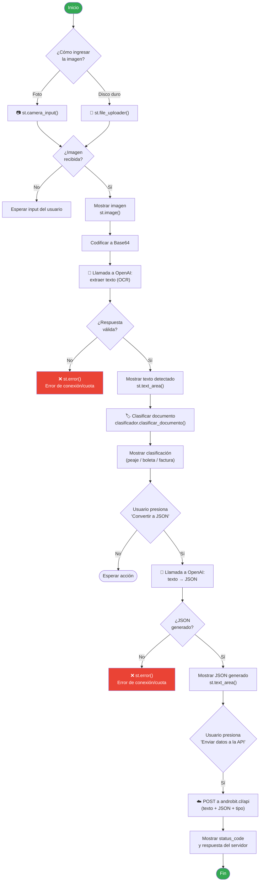

# 🧾 Visionticks 1.0

**Clasificación inteligente de tickets, boletas y facturas usando IA**

[](https://www.python.org/)
[](https://streamlit.io/)
[](https://openai.com/)
[](#-licencia)

Visionticks es una aplicación web construida con **Streamlit** que permite capturar o subir imágenes de documentos chilenos (tickets de peaje, boletas y facturas), extraer su contenido mediante **OCR con IA (GPT-4.1-mini)**, clasificarlos automáticamente y convertirlos en datos estructurados **JSON** listos para integrarse con sistemas externos.

---

## 📑 Tabla de contenidos

- [Descripción](#-descripción)
- [Arquitectura de software](#-arquitectura-de-software)
- [Flujo de la aplicación](#-flujo-de-la-aplicación)
- [Características](#-características)
- [Estructura del proyecto](#-estructura-del-proyecto)
- [Requisitos](#-requisitos)
- [Instalación](#-instalación)
- [Configuración](#-configuración)
- [Uso](#-uso)
- [Stack tecnológico](#-stack-tecnológico)
- [Variables de entorno](#-variables-de-entorno)
- [Roadmap](#-roadmap)
- [Contribuir](#-contribuir)
- [Licencia](#-licencia)

---

## 📖 Descripción

El usuario captura una imagen (por cámara o desde disco), la aplicación:

1. Codifica la imagen en **Base64**.
2. Envía la imagen a un modelo de **OpenAI (gpt-4.1-mini)** para extraer el texto (OCR).
3. Clasifica el documento (peaje, boleta o factura) usando el módulo `clasificador`.
4. Convierte el texto extraído en un **JSON estructurado** mediante un segundo prompt a la IA.
5. Envía el paquete de datos (texto + JSON + clasificación) a una **API externa** (`androbit.cl`) para su almacenamiento o procesamiento posterior.

---

## 🏗 Arquitectura de software



### Componentes principales

| Componente | Responsabilidad |
|---|---|
| **Streamlit UI** | Interfaz web, captura de inputs del usuario y renderizado de resultados |
| **`st.session_state`** | Persistencia de estado entre recargas (evita repetir llamadas costosas a la IA) |
| **`decodificar_imagen_a_base64()`** | Convierte la imagen (PIL) a string Base64 para enviarla a la API |
| **`prompt_para_extraer_texto()`** | Llama a OpenAI para hacer OCR sobre la imagen |
| **`clasificador.py`** | Clasifica el texto detectado en tipo de documento |
| **`promt_para_convertir_texto_a_json()`** | Convierte el texto OCR en JSON estructurado con reglas específicas para boletas chilenas |
| **`enviar_paquetes()`** | Envía el resultado final (texto + JSON + clasificación) a la API externa vía `requests.post` |

---

## 🔄 Flujo de la aplicación



---

## ✨ Características

- 📷 **Doble modo de captura**: cámara en vivo o carga de archivo desde disco.
- 🔍 **OCR con IA**: extracción de texto desde imágenes usando `gpt-4.1-mini`.
- 🏷️ **Clasificación automática**: identifica si el documento es un ticket de peaje, boleta o factura.
- 🧩 **Conversión a JSON estructurado**: normaliza montos, fechas (`YYYY-MM-DD`) y listas de ítems.
- ☁️ **Integración con API externa**: envío automático de los datos procesados a un backend propio.
- 💾 **Gestión de estado**: evita llamadas duplicadas a la IA mediante `st.session_state`.

---

## 📂 Estructura del proyecto

```
visionticks/
├── main.py                # Aplicación principal Streamlit (código base de este README)
├── clasificador.py        # Lógica de clasificación de documentos
├── requirements.txt        # Dependencias del proyecto
├── .streamlit/
│   └── secrets.toml        # Claves API (OPENAI_API_KEY) — NO subir a git
└── README.md
```

---

## ✅ Requisitos

- Python 3.10 o superior
- Cuenta y clave API de [OpenAI](https://platform.openai.com/)
- Acceso al endpoint de la API externa (`androbit.cl/api`)

---

## 🚀 Instalación

```bash
# 1. Clonar el repositorio
git clone https://github.com/tu-usuario/visionticks.git
cd visionticks

# 2. Crear entorno virtual
python -m venv venv
source venv/bin/activate      # En Windows: venv\Scripts\activate

# 3. Instalar dependencias
pip install streamlit openai pillow requests
```

---

## ⚙️ Configuración

Crea el archivo `.streamlit/secrets.toml` en la raíz del proyecto:

```toml
OPENAI_API_KEY = "tu-clave-de-openai-aqui"
```

> ⚠️ **Importante:** nunca subas este archivo a un repositorio público. Agrégalo a tu `.gitignore`.

---

## ▶️ Uso

```bash
streamlit run main.py
```

1. Abre el navegador en `http://localhost:8501`.
2. Elige el modo de ingreso de imagen (foto o disco duro).
3. Presiona **Continuar**.
4. Captura o sube la imagen del documento.
5. Revisa el texto detectado y la clasificación automática.
6. Presiona **Convertir a JSON** para estructurar los datos.
7. Presiona **Enviar datos a la API** para enviar el resultado al backend.

---

## 🧰 Stack tecnológico

| Categoría | Tecnología |
|---|---|
| Frontend / UI | [Streamlit](https://streamlit.io/) |
| IA / OCR | [OpenAI API](https://platform.openai.com/) (`gpt-4.1-mini`) |
| Procesamiento de imágenes | [Pillow (PIL)](https://python-pillow.org/) |
| Comunicación HTTP | [Requests](https://requests.readthedocs.io/) |
| Lenguaje | Python 3.10+ |

---

## 🔐 Variables de entorno

| Variable | Descripción | Origen |
|---|---|---|
| `OPENAI_API_KEY` | Clave privada para autenticar contra la API de OpenAI | `.streamlit/secrets.toml` |

> La clave de la API externa (`androbit.cl`) actualmente se encuentra hardcodeada en el código fuente. Se recomienda migrarla también a `secrets.toml` por seguridad.

---

## 🗺️ Roadmap

- [ ] Mover la API Key de `androbit.cl` a variables de entorno seguras.
- [ ] Agregar manejo de errores más granular (diferenciar `RateLimitError` de otros fallos).
- [ ] Añadir soporte multi-idioma en la extracción OCR.
- [ ] Historial de documentos procesados por sesión.
- [ ] Tests automatizados para `clasificador.py`.

---

## 🤝 Contribuir

Las contribuciones son bienvenidas. Para proponer cambios:

1. Haz un fork del repositorio.
2. Crea una rama: `git checkout -b feature/nueva-funcionalidad`.
3. Realiza tus cambios y haz commit: `git commit -m "Agrega nueva funcionalidad"`.
4. Sube la rama: `git push origin feature/nueva-funcionalidad`.
5. Abre un Pull Request.

---

## 📄 Licencia

Este proyecto se distribuye bajo la licencia **MIT**. Consulta el archivo `LICENSE` para más detalles.
